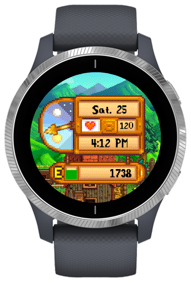

# Starface

A Stardew Valley inspired watch face designed for the Garmin Vivoactive 4. May work on other watches, but has not been tested.

## Credits
Designs for the UI inspired by clock face created by [Paprika](https://gitlab.com/nlucassoares) on Gitlab. Find the repo [here](https://gitlab.com/nlucassoares/clock).

## Overview

The watchface shows a simple set of metrics for the user. This includes the heartrate (next to the heart), date/day of the week, time, pedometer (on the bottom), and battery status (next to the E).

